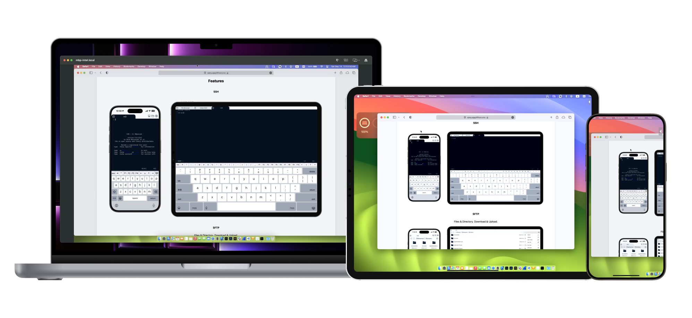

# Xany VNC
A vnc client for Apple platforms.

macOS 11.0+ | iOS/iPadOS 17.0+ | VisionOS 1.0+

- Compatible with standard vnc servers
- Supports None, VNC and ARD authentications
  
 When connected to Xanyd server, you will get:
- Secure connection (TLS 1.3)
- Multiple displays
- Curtain mode  

 ## Screen shots
 
 
